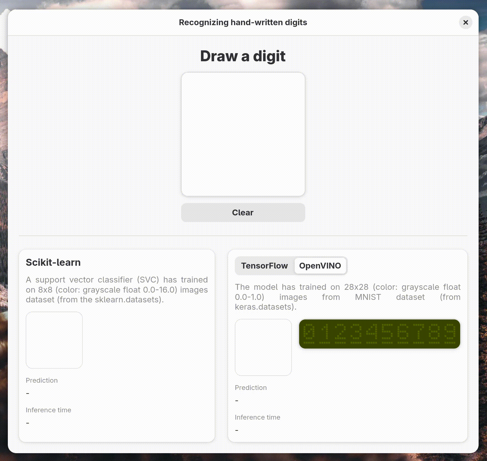

# ML Digits

A GTK desktop app for recognizing hand-written digits from a drawing canvas, with live predictions from:
- **Scikit-learn** (SVM, 8×8)
- **TensorFlow** (MNIST, 28×28)
- **OpenVINO** (optimized TensorFlow model)

## Quick start

1. Install dependencies:
   - `uv sync`
2. Run the app:
   - `./run.sh`

`run.sh` compiles the Blueprint UI and starts the app.

## How to use

1. Draw a digit in the canvas.
2. See predictions and inference time update in real time.
3. Switch between **TensorFlow** and **OpenVINO** to compare results.
4. Click **Clear** to reset the canvas.

## License

GPL-3.0-or-later. See `LICENSE.md`.
